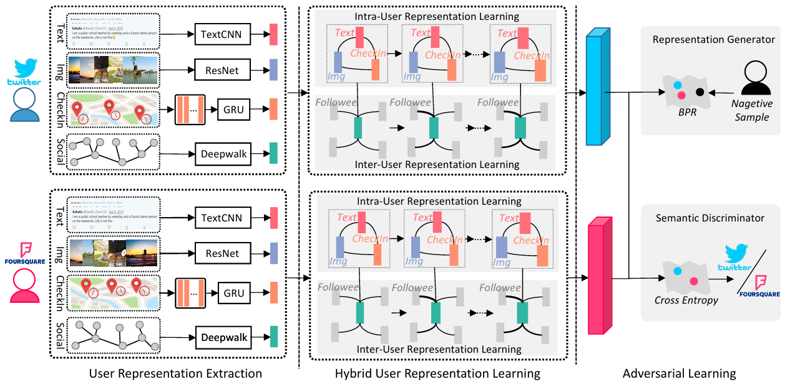

# Adversarial-Enhanced Hybrid Graph Network for User Identity Linkage

> [SIGIR 2021] Official implementation of AHG-Net, a novel adversarial-enhanced hybrid graph network for user identity linkage across social media platforms.

## Authors

**Xiaolin Chen**<sup>1</sup>, **Xuemeng Song**<sup>1</sup>\*, **Guozhen Peng**<sup>1</sup>, **Shanshan Feng**<sup>2</sup>, **Liqiang Nie**<sup>1</sup>\*

<sup>1</sup> Shandong University, Shandong, China  
<sup>2</sup> Harbin Institute of Technology, Shenzhen, China  
\* Corresponding authors

## Links

- **Paper**: [ACM Digital Library](https://doi.org/10.1145/3404835.3462946)
- **PDF**: [Paper PDF](https://xuemengsong.github.io/SIGIR_User.pdf)
- **Dataset**: [Baidu Netdisk](https://pan.baidu.com/s/18Tf6ftWPnNmRnQTGeYbkAg) (Password: `6kzl`)

---

## Table of Contents

- [Updates](#updates)
- [Introduction](#introduction)
- [Highlights](#highlights)
- [Method / Framework](#method--framework)
- [Project Structure](#project-structure)
- [Dataset](#dataset)
- [Usage](#usage)
- [Citation](#citation)
- [Acknowledgement](#acknowledgement)
- [License](#license)

---

## Updates

- [07/2021] Paper accepted at SIGIR 2021
- [07/2021] Release code and dataset

---

## Introduction

This repository is the official implementation of the paper **"Adversarial-Enhanced Hybrid Graph Network for User Identity Linkage"**, published at SIGIR 2021.

We investigate the user identity linkage task across different social media platforms (e.g., Twitter and Foursquare) based on heterogeneous multi-modal posts and social connections. This task is challenging due to two key issues: (1) each user involves both intra multi-modal posts (textual, visual, check-in) and inter social connections, making comprehensive user representation learning difficult; and (2) even for the same user identity, representations on different platforms tend to be dissimilar due to discrepant data distributions (i.e., the semantic gap problem).

To address these challenges, we propose **AHG-Net** (Adversarial-enhanced Hybrid Graph Network), which consists of three key components:

- **User Representation Extraction**: Extracts intermediate representations from heterogeneous multi-modal posts and social connections using advanced deep learning techniques (TextCNN, GRU, ResNet, DeepWalk).
- **Hybrid User Representation Learning**: Unifies intra-user representation learning (multi-modal fusion) and inter-user representation learning (social influence modeling) with a hybrid graph neural network.
- **Adversarial Learning**: Deploys a semantic discriminator to encourage learned user representations of the same identity across platforms to be similar, alleviating the semantic gap problem.

We also build a new multi-modal dataset by augmenting an existing public dataset with 62,021 visual posts collected from Twitter and Foursquare.

---

## Highlights

- Jointly models multi-modal user content (text, image, check-in) and social connections for user identity linkage
- Proposes a hybrid graph network to unify intra-user and inter-user representation learning
- Introduces adversarial learning to bridge the semantic gap across different social platforms
- Provides a multi-modal user identity linkage dataset with 62,021 images from Twitter and Foursquare
- Achieves state-of-the-art performance on user identity linkage benchmarks

---

## Method / Framework



**Figure 1.** Overall framework of AHG-Net. The network contains three key components: user representation extraction, hybrid user representation learning, and adversarial learning. "Text", "Img", "CheckIn", and "Social" refer to textual posts, visual posts, check-in posts, and social connections, respectively.

---

## Project Structure

```text
.
├── UIL_SIGIR.py            # Main entry point for training and evaluation
├── flip_gradient.py        # Gradient reversal layer for adversarial learning
├── load_data_new.py        # Data loading and preprocessing utilities
└── README.md
```

---

## Dataset

We build a multi-modal user identity linkage dataset by augmenting an existing public dataset with 62,021 images collected from Twitter and Foursquare.

- **Download**: [Baidu Netdisk](https://pan.baidu.com/s/18Tf6ftWPnNmRnQTGeYbkAg)
- **Password**: `6kzl`

After downloading, please place the data files in the project directory and ensure the paths in `load_data_new.py` are configured correctly.

---

## Usage

### Training and Evaluation

```bash
python UIL_SIGIR.py
```

---

## Citation

If you find this work useful for your research, please cite our paper:

```bibtex
@inproceedings{chen2021adversarial,
  title={Adversarial-Enhanced Hybrid Graph Network for User Identity Linkage},
  author={Chen, Xiaolin and Song, Xuemeng and Peng, Guozhen and Feng, Shanshan and Nie, Liqiang},
  booktitle={Proceedings of the 44th International ACM SIGIR Conference on Research and Development in Information Retrieval},
  pages={1084--1093},
  year={2021},
  doi={10.1145/3404835.3462946}
}
```

---

## Acknowledgement

- Thanks to our collaborators for their valuable support.
- Thanks to the open-source community for providing useful baselines and tools.

---

## License

This project is released under the Apache License 2.0.
